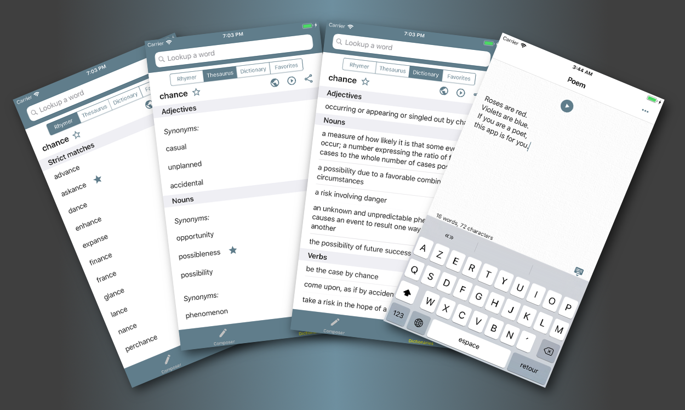

# Poet Assistant iOS

Poet Assistant is an iOS app which offers a set of tools to help with writing poems:

* a rhyming dictionary, using the Carnegie Mellon University pronunciation dictionary.
* a thesaurus, using the WordNet thesaurus.
* a dictionary, using the WordNet dictionary.
* a screen where you can enter your poem text, and have it read aloud back to you by the device's text-to-speech engine.

The app was initially made for Android. The source code for that project is also on github: [https://github.com/caarmen/poet-assistant](https://github.com/caarmen/poet-assistant)

The iOS app doesn't yet have all the features of the Android app.

These are all the screens so far:

